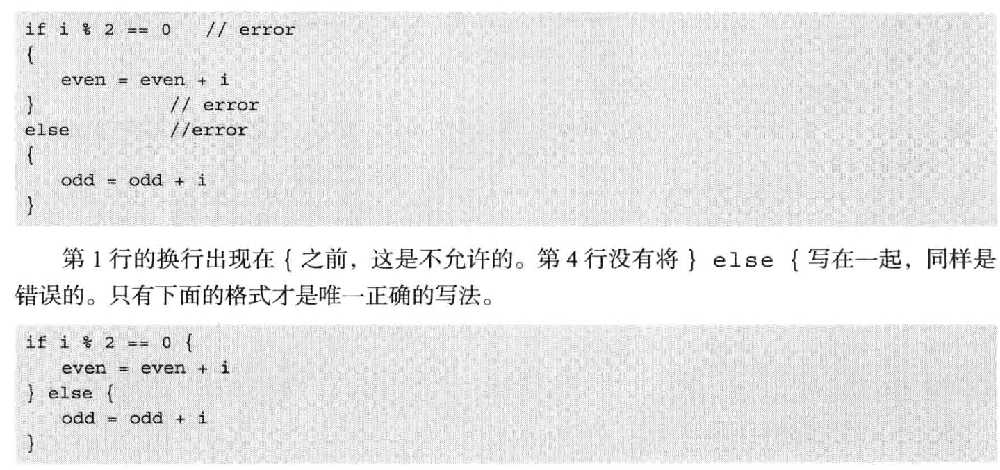

# day2 设计程序设计语言

本书亮点：首先是设计一种极为简单的语言并开发相应的语言处理器，确保程序能正确运行。然后再慢慢的添加诸如面向对象等复杂功能。——由简单到复杂

## Stone的语法特点

- 实现基本控制语句，诸如if、while等。
- 弱数据类型，变量在使用之前不需要事先声明，也无需指定数据类型。
- 句末可以不加分号，但如果一行中有多条语句则分号不能省。花括号语句体的最后一条语句可以不加分号。
- 不支持return功能，最后一条语句的计算结果就是整个程序的运行结果，会输出结果值。
- while、if语句没有小括号。
- 语句体必须使用花括号括起来。
- “//”作为注释符。

