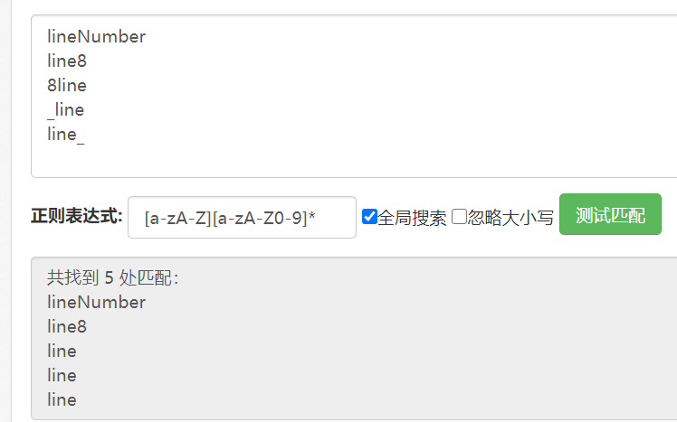
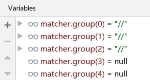
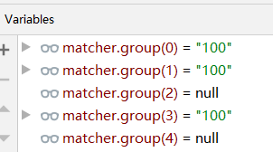
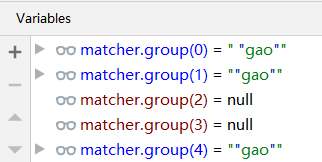
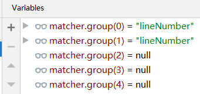

# day3 分割单词

即：词法分析器

理论基础可以参考《现代编译原理 C语言描述》和国防科技大学 编译原理 -王挺 公开课、word笔记等资源。

词法分析器干的事：将程序源代码一长串字符串切割成单词。——这就是词法分析

## Token对象

while i < 10 {

词法分析会将其拆成五个字符串：

"whiile", "i", "<", "10", "{"

上面的词法分析结果被称为Token。

分割后的不仅仅是字符串，还有单词的类型，单词所处的位置行号等信息。

### 预处理

单词之前的空白和注释会被忽略。

理论基础是自动机，正规表达式。

### 三种类型的单词

Token根据单词的类型又定义了子类。分别是：标识符、整型字面量和字符串字面量。

此外，还定义了一种特别的单词“Token.EOF”用于表示程序的结束；Token.EOL表示换行符。——他们都是纯粹的String对象。

## 正则表达式

```
[0-9]+
```

0 1 2 3 4 5 6 7 8 9 十个数字至少出现一次。


标识符：

```
[a-zA-Z][a-zA-Z0-9]*
```

标识符是由：至少需要一个字母数字或下划线，并且首字符不能是数字。

[a-zA-Z]：匹配26个英文大写和小写字母

[a-zA-Z0-9]：匹配26个英文大写和小写字母、阿拉伯数字**——前面的所有情况都匹配了**




Stone语言标识符还包括各类符号：

下面的才是真正的正则表达式：

```
[a-zA-Z][a-zA-Z0-9]*|==|<=|>=|&&|\|\||\p{Punct}}
```

\p{Punct}：匹配标点字符。


字符串字面量：

因为字符串中间可以有 \n 、 \\" 、  \\\ 三种转义字符。分别表示换行（\n）、双引号（“）和反斜杠（\）。

```
"(\\"|\\\\|\\n|[^"])*"
```


与0个及0个以上的空字符匹配：

```
\s*
```


匹配由 // 开始的任意长度字符串：

```
//.*
```


```
\s*(       (//.*)|(pat1)|(pat2)|pat3      )?
```

​	    |                |			 |			|

第1个左括号  第2个   第3个        第4个左括号

- pat1：整型字面量正则式
- pat2：字符串字面量
- pat3：标识符

匹配情况：

- 如果匹配的字符串是一句注释：左起第2个左括号、第3个左括号都是null

  

- 如果匹配的是整型字面量：左起第2、第3、第4左括号是null

  

- 匹配字符串：2、3、4对应null

  

- 匹配标识符：将与第一个左括号对应、其余都是null

  


最后，我们要写的正则表达式汇总写为：

具体正则表达式为：`"\\s*((//.*)|([0-9]+)|(\"(\\\\\"|\\\\\\\\|\\\\n|[^\"])*\")|[A-Z_a-z][A-Z_a-z0-9]*|==|<=|>=|&&|\\|\\||\\p{Punct})?";`			

- 匹配时首先跳过这一行的空格（`"\\s*"`），后面的内容都为有效的内容，因此用一个大的括号括起来，便于得到其内容。							

- `//.*`用于匹配注释
- `"[0-9]+"`用来匹配数值
- `\"(\\\\\"|\\\\\\\\|\\\\n|[^\"])*\"`用来对匹配字符串

```
\\\\\"      这一部分用来匹配字符串中的   \"
\\\\\\\\    用来匹配字符串中的          \\
\\\\n       用来匹配字符串中的          \n
```

- `[^\"]`用来匹配一切非`"`字符