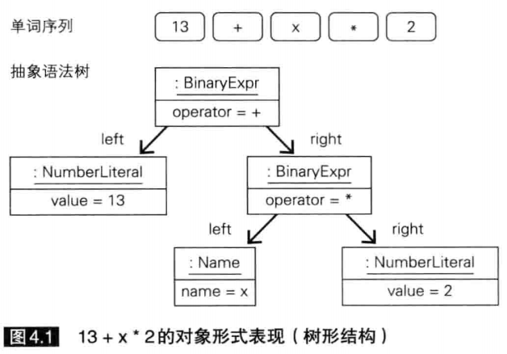
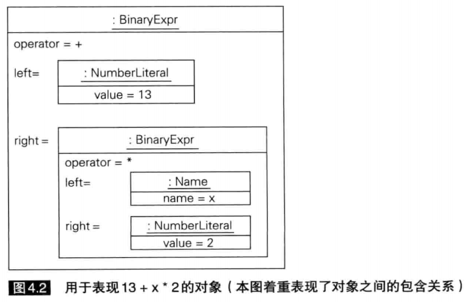
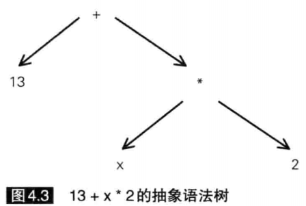

# day4 用于表示程序的对象

语法分析：主要任务是分析单词之间的关系，例如括号匹配，语句组合等问题。这阶段还需要检查语法错误。

## 语法树

下图是单词序列 13 + x * 2的语法树：

因为我们的Stone语言采用的是java实现的，在面向对象的语言语言中可以使用类做具体的实现：

但是，具体的实现不唯一。例如在c语言中是利用结构体来实现的。

为了规避这种表述不唯一的问题，我们直接通过抽象语法树来描述语法分析的结果：

## 节点类代码

各种节点类的代码请参考代码文件。

其中写完本节，感受最深的就是各种类之间的关联。子类重写父类中的构造方法这些。

还有就是，之前在写day3中有些不理解用途的代码，在本节中补充回来了。