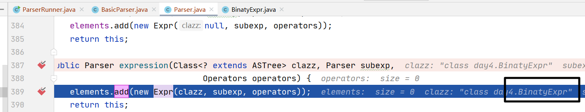

# day5 设计语法分析器

## 5.2 使用解析器与组合子（作者的Parser库）

本节，我们使用了作者的Parser库。

我们把Parser.java放在了day5文件夹中，但之后调用里面的函数的时候会报错，最后发现是包依赖关系的问题，我们修改了Patser.java中的代码，匹配了正确的依赖后就可以正常调用了。

另外，我们还发现Parser.java中修改依赖后还会有很多红色错误，原因是之前我们在day3中省略了异常处理，而Parser确调用了异常，找不到异常处理函数当然会红色错误。——我们先写BasicParser，写完后再重新去day3中添加上异常处理，这样也算完整了。

还有红色问题，因为我们在day3中的Lexer.java中省略了一些函数（当时我不理解写这些函数干嘛用，现在才明白会被Parser.java调用）。一会儿我们还要去day3中加上他们。

到了现在，我们完成了5.2节。

接下来，我们要在5.3节完成带红色下划线的类。以生成抽象语法树。

## 5.3 由语法分析器生成的抽象语法树

写的时候，这么多红色下划线文件，应该先修改哪个呢？

害，看下书本P56页。按着它给的几种树，从下往上分析呗。这其实不就是顺序嘛。

PrimaryExpr --> NegativeExpr --> BlockStmnt.java --> IfStmnt.java -->  WhileStmnt.java --> StringLiteral.java

都写好后，开始写启动类。

启动类写完后，运行，报错：

可能是？我们之前为了省事，LexerRunner类main方法的异常处理没写，我们加上去。

还不行，那看看报什么错误吧。应该还是异常处理的问题。

学会查错

第一步：在启动类中用注释，排除LexerRunner即词法分析器的错误。确定是BasicParser basicParser = new BasicParser();的错误。

第二步：打断点运行后，程序单步调试运行到 Parser expr = expr0.expression(BinatyExpr.class, factor, operators); 行时抛出异常错误。——即本行内部有错。

第三步：再次单步调试，在即将指向上面这一行的时候，进入内部调试。发现elements.add(new Expr(clazz, subexp, operators)); 这一行有错误。看下图：

因为我们知道，Parser库是直接用的作者的，代码是不可能有错的。上面这行代码用到了 BinatyExpr类。那么问题就清晰明了了。——BinatyExpr类的问题。

原因就是之前写第28行代码的时候不明白为什么不能用child(1)方法获取运算符，我就试了下，但书本代码不是这样子的。

改了后，再运行，依然此错误。经过断点测试，问题一定还是在 BinatyExpr类。我们重点排查 BinatyExpr 类。与书本对照发现问题。

为什么书本用的是List：

而不是我写的ArrayList？

Yes！没问题了，运行。

kao！

为啥这么多括号？？？

看下反白部分，this的内容不正确。本身就带有很多括号。

问题还是在PrimaryExpr，我们修改下，OK了（具体看代码里的注释，是我自己写的return有逻辑错误）。